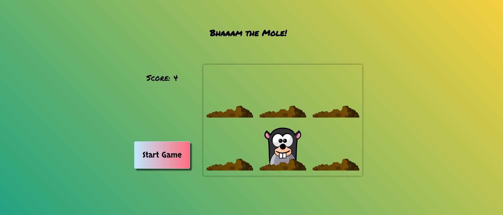

## Synopsis

This is a JavaScript Game.

Bham the mole with a mouse click. Let`s see how many moles you can get in 10 seconds.

This game was created using:

* HTML
* CSS
* JavaScript

## Live Demo

To see the live demo, please [click here](https://patriciageo3.github.io/Bham-game/).

## How to play

* Click on Start Game
* Catch the moles with mouse clicks
* Have some fun!

## Authors

Patricia Georgescu

## License & Copyrights
This is part of the JS30-days challenge from Wes Bos.

## Quick Live Preview
